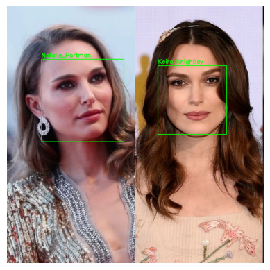

# 🔎 Reconhecimento Facial em Imagens

Este projeto implementa um sistema de **reconhecimento facial em imagens estáticas**, capaz de:

- Detectar rostos em imagens.
- Desenhar **bounding boxes** ao redor das faces.
- Identificar pessoas conhecidas e exibir seus nomes.
- Marcar rostos não reconhecidos como **"Desconhecido"**.

O projeto foi desenvolvido em **Python**, utilizando as bibliotecas `face_recognition` e `OpenCV`.

---

## 📂 Estrutura do Projeto

Reconhecimento Facial/
│── data/
│ ├── Alice/
│ │ ├── train_embeddings.pkl
│── Imagens_teste
│ ├── teste.jpg
│── imagens_treinamento
│ ├── Keira Knightley/
│ ├── Natalie Portman/
│── models/
│ ├── classifier.joblib
│── encodings.pickle
│── README.md
│── Reconhecimento-Facial-DIO.ipynb


- **imagens_treinamento/** → imagens de referência (uma pasta por pessoa).
- **imagens_teste/** → imagens onde será feito o reconhecimento.
- **treinar_encodings.py** → script para gerar os vetores de características (encodings).
- **reconhecimento.py** → script para detectar e identificar rostos em imagens de teste.
- **encodings.pickle** → arquivo com os encodings salvos após o treinamento.

---

## 🚀 Como Executar

### 1️⃣ Instalar dependências
<pre>
```bash

pip install face-recognition
pip install opencv-python
pip install matplotlib </pre>

⚠️ No Linux, pode ser necessário instalar pacotes adicionais:
<pre>
```bash

sudo apt-get install cmake libdlib-dev</pre>

2️⃣ Treinar os encodings

Coloque imagens de cada pessoa dentro de uma pasta com seu nome em imagens_treinamento/

3️⃣ Rodar o reconhecimento

Para testar em uma imagem de imagens_teste o script vai carregar os encodings, detectar os rostos e exibir a imagem com caixas e nomes.

🖼️ Exemplo de Saída

Entrada (teste.jpg):

Saída (com bounding boxes):

⚙️ Tecnologias Utilizadas

Python

face_recognition

OpenCV

dlib

📌 Melhorias Futuras

Processar uma pasta inteira de imagens automaticamente.

Salvar os resultados em uma nova pasta em vez de apenas exibir.

Adicionar suporte para vídeo em tempo real.

👩‍💻 Autora

Projeto desenvolvido por Denise Potenza ✨